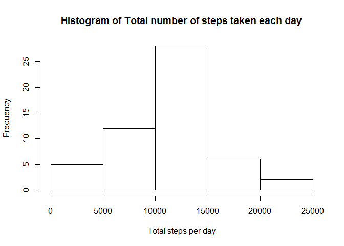
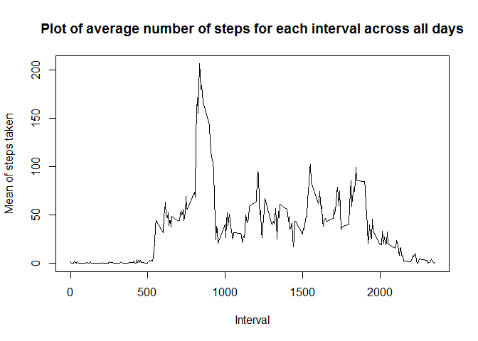
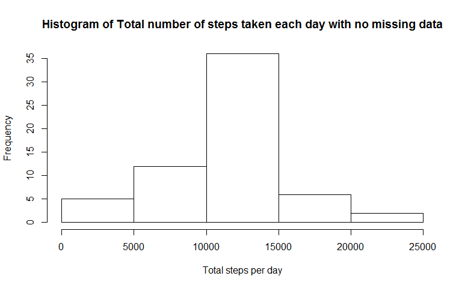
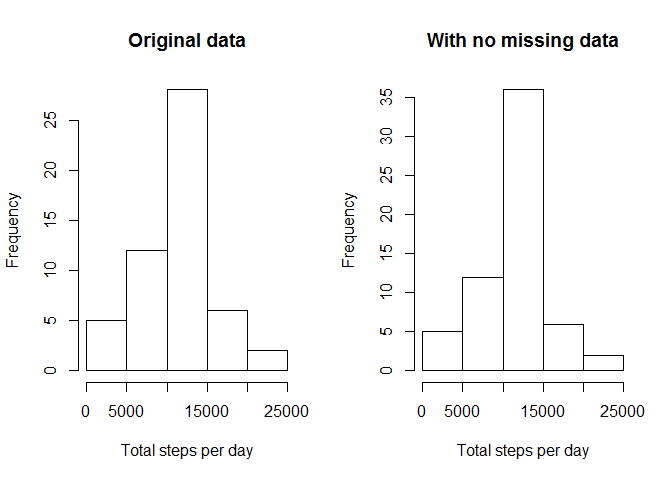
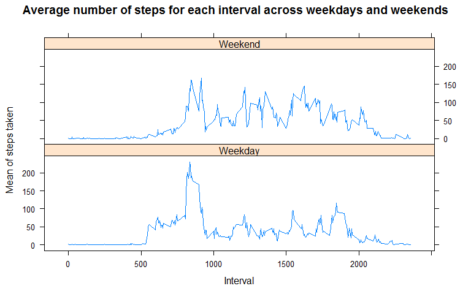

# Reproducible Research: Peer Assessment 1

This is a simple analysis of the activity data collected by a subject during the months of October and November 2012. The data collected is the number of steps taken in 5 minute intervals each day.

The data is available [here](https://d396qusza40orc.cloudfront.net/repdata%2Fdata%2Factivity.zip).

The variables included in this dataset are:

- **steps**: Number of steps taken in a 5-minute interval (missing values are coded as NA)

- **date**: The date on which the measurement was taken in YYYY-MM-DD format

- **interval**: Identifier for the 5-minute interval in which measurement was taken

The dataset is stored in a comma-separated-value (CSV) file and there are a total of 17,568 observations.

## Loading and preprocessing the data

The activity.csv file is extracted from the zipped file to the activity folder in your current working directory. 
 

```r
activity <- read.csv("activity/activity.csv",header=TRUE,stringsAsFactors = FALSE)
dim(activity)
```

```
## [1] 17568     3
```

The data read has 17568 observations and 3 columns.


```r
str(activity)
```

```
## 'data.frame':	17568 obs. of  3 variables:
##  $ steps   : int  NA NA NA NA NA NA NA NA NA NA ...
##  $ date    : chr  "2012-10-01" "2012-10-01" "2012-10-01" "2012-10-01" ...
##  $ interval: int  0 5 10 15 20 25 30 35 40 45 ...
```

The format of the data is as required for the initial analysis.


```r
head(activity)
```

```
##   steps       date interval
## 1    NA 2012-10-01        0
## 2    NA 2012-10-01        5
## 3    NA 2012-10-01       10
## 4    NA 2012-10-01       15
## 5    NA 2012-10-01       20
## 6    NA 2012-10-01       25
```

Also, a sample of the data is shown above. 


```r
head(activity$interval,30)
```

```
##  [1]   0   5  10  15  20  25  30  35  40  45  50  55 100 105 110 115 120
## [18] 125 130 135 140 145 150 155 200 205 210 215 220 225
```

```r
tail(activity$interval,30)
```

```
##  [1] 2130 2135 2140 2145 2150 2155 2200 2205 2210 2215 2220 2225 2230 2235
## [15] 2240 2245 2250 2255 2300 2305 2310 2315 2320 2325 2330 2335 2340 2345
## [29] 2350 2355
```

The 5 minute intervals are coded such that, 0 is the first 5 minute inteval that starts at 12:00 AM. 5 is the start of the next 5 minute interval at 12:05 AM, 10 starts at 12:10 AM, and so on till 55 is for the interval at 12:55 AM. The next interval 100 is the 5 minute interval that starts at 1:00 AM, 105 for 1:05 AM and so on till 155 is for 1:55 AM and 200 is for 2:00 AM. And so on till 2355, to represent the interval at 23:55 PM (11:55 PM).

## What is mean total number of steps taken per day?

Shown below is the histogram of the total number of steps taken for each day.


```r
library(plyr)
totStepsDay<- ddply(activity,.(date),summarize,daytotal = sum(steps))
with(totStepsDay,hist(daytotal,xlab="Total steps per day",main="Histogram of Total number of steps taken each day"))
```




```r
mean(totStepsDay$daytotal,na.rm = TRUE)
```

```
## [1] 10766
```

```r
median(totStepsDay$daytotal,na.rm = TRUE)
```

```
## [1] 10765
```

Ignoring the missing values, the mean of the total number of steps taken per day is 10766 steps. The median of the total number of steps taken per day is 10765.


## What is the average daily activity pattern?

Shown below is the histogram of mean of the total steps taken during each 5 minute interval across all the days.


```r
mnStepsInt <- ddply(activity,.(interval),summarize,intervalmean = mean(steps,na.rm=TRUE))
##dim(mnStepsInt)
##head(mnStepsInt)
with(mnStepsInt,plot(interval,intervalmean,type='l',main='Plot of average number of steps for each interval across all days',xlab='Interval',ylab='Mean of steps taken'))
```




```r
mnStepsInt[which(mnStepsInt$intervalmean == max(mnStepsInt$intervalmean)),]
```

```
##     interval intervalmean
## 104      835        206.2
```

On average, the maximum number of steps the subject takes in a 5 minute interval each day is 206 at 8:35 AM.

## Imputing missing values

There are a total of 2304 observations with missing data.


```r
sum(is.na(activity))
```

```
## [1] 2304
```

The result below shows that all days in October and November are included in the data set.


```r
sum(is.na(activity$date))
```

```
## [1] 0
```

The dataset provided has no data available for 8 days. Those days are shown below.


```r
nadata <- activity[which(is.na(activity)),]
##dim(nadata)
table(nadata$date)
```

```
## 
## 2012-10-01 2012-10-08 2012-11-01 2012-11-04 2012-11-09 2012-11-10 
##        288        288        288        288        288        288 
## 2012-11-14 2012-11-30 
##        288        288
```

The 288 for each day is the same as the total number of 5 minute intervals in a 24 hour period. A good fill in for these missing values would be the average number of steps taken during each 5 minute interval across all days. For intervals where most of the days there are no steps (early in the morning and late at night), formatting the average of the steps as integer makes it zero. So that the number of steps taken during that interval reflects the more frequent data for that interval, which is zero. 


```r
naindices <- which(is.na(activity))
##length(naindices)
noNAactivity <- activity
for(i in 1:length(naindices)){noNAactivity$steps[naindices[i]] <- as.integer(mnStepsInt$intervalmean[mnStepsInt$interval ==                                                                                               noNAactivity$interval[naindices[i]]])}
sum(is.na(noNAactivity))
```

```
## [1] 0
```

Using the strategy above, the noNAactivity copy of the original data is created to have no missing values.


```r
noNAtotStepsDay <- ddply(noNAactivity,.(date),summarize,daytotal = sum(steps))
with(noNAtotStepsDay,hist(daytotal,xlab="Total steps per day",main="Histogram of Total number of steps taken each day with no missing data"))
```



The histogram above shows mean of the total steps taken during each 5 minute interval across all the days with no missing data.


```r
par(mfrow=c(1,2))
with(totStepsDay,hist(daytotal,xlab="Total steps per day",main="Original data"))
with(noNAtotStepsDay,hist(daytotal,xlab="Total steps per day",main="With no missing data"))
```



The new histogram shows the increased counts because of imputing the missing values. 

With data missing for eight days, the mean is 10766 and the median is 10765. 


```r
mean(totStepsDay$daytotal, na.rm = TRUE)
```

```
## [1] 10766
```

```r
median(totStepsDay$daytotal, na.rm = TRUE)
```

```
## [1] 10765
```

With no missing data, the mean is 10749 and the median is 10641. 


```r
mean(noNAtotStepsDay$daytotal)
```

```
## [1] 10750
```

```r
median(noNAtotStepsDay$daytotal)
```

```
## [1] 10641
```

Imputing the missing values decreases the mean and median values.

## Are there differences in activity patterns between weekdays and weekends?
To factor the days into weekday (Monday through Friday) and weekend (Saturday and Sunday), a new column is added to the data set (with no missing values) that gives the day of the week. 


```r
noNAactivity$day <- weekdays(as.Date(noNAactivity$date))
##dim(noNAactivity)
table(noNAactivity$day)
```

```
## 
##    Friday    Monday  Saturday    Sunday  Thursday   Tuesday Wednesday 
##      2592      2592      2304      2304      2592      2592      2592
```

The rows with weekend days are identified.


```r
weekend <- which(noNAactivity$day %in% c("Saturday","Sunday"))
length(weekend)
```

```
## [1] 4608
```

A new column that shows whether it is a weekday or weekend is added. After coding the type of the day, the column is changed to a factor column.


```r
noNAactivity$daytype <- "Weekday"
for(i in 1:length(weekend)){
  noNAactivity$daytype[weekend[i]] <- "Weekend"}
noNAactivity$daytype <- as.factor(noNAactivity$daytype)
##dim(noNAactivity)
str(noNAactivity)
```

```
## 'data.frame':	17568 obs. of  5 variables:
##  $ steps   : int  1 0 0 0 0 2 0 0 0 1 ...
##  $ date    : chr  "2012-10-01" "2012-10-01" "2012-10-01" "2012-10-01" ...
##  $ interval: int  0 5 10 15 20 25 30 35 40 45 ...
##  $ day     : chr  "Monday" "Monday" "Monday" "Monday" ...
##  $ daytype : Factor w/ 2 levels "Weekday","Weekend": 1 1 1 1 1 1 1 1 1 1 ...
```

The figure below shows the average number of steps taken for each 5 minute interval across weekdays and weekends.


```r
mnStepsIntDay <- ddply(noNAactivity,.(interval,daytype),summarize,intervalmean = mean(steps))
##dim(mnStepsIntDay)
##head(mnStepsIntDay)
library(lattice)
xyplot(intervalmean ~ interval | daytype, data = mnStepsIntDay, layout = c(1,2),type = 'l',xlab = "Interval",ylab = "Mean of steps taken",main = "Average number of steps for each interval across weekdays and weekends")
```



We can see that on weekdays, the activity peaks at around 8:35 AM. There are three more peak activity times as the day progresses. Also, the subject is more active early in the morning compared to the weekends. 

During the weekends, the subject is relatively more active. The activity is more evenly distributed across the day.
